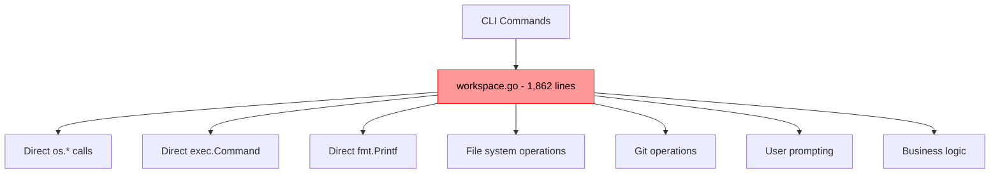
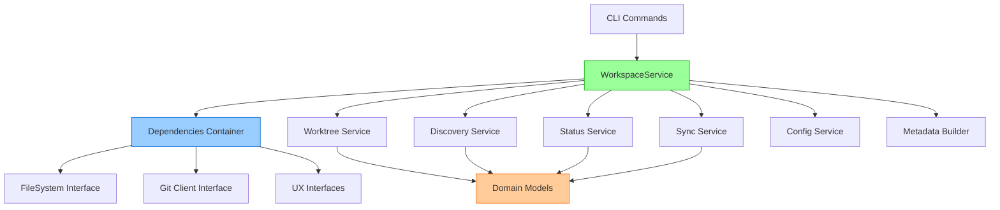

# WSM Migration Guide for New Contributors

Welcome to the Workspace Manager (WSM) project! This guide will help you understand the current state of our major refactoring effort and how to contribute effectively.

## 🎯 Project Overview

### What is WSM?
Workspace Manager (WSM) is a CLI tool that creates and manages multi-repository workspaces using Git worktrees. It allows developers to work on multiple related repositories simultaneously in a single workspace, with automatic branch synchronization and dependency management.

### The Refactoring Challenge
We inherited a **1,862-line god file** (`pkg/wsm/workspace.go`) that mixed business logic, I/O operations, git commands, and user interactions all in one place. This made the code:
- Hard to test (required actual git repositories)
- Difficult to maintain (everything coupled together)
- Impossible to extend (changes affected everything)
- Painful to debug (no clear separation of concerns)

### What We've Accomplished ✅

**New Service Architecture (Complete)**
- ✅ Clean service architecture with dependency injection
- ✅ Testable components with interface abstractions
- ✅ Separation of concerns (domain, services, adapters)
- ✅ Full test coverage for new components

**Migrated Commands (Production Ready)**
- ✅ `create-v2` - Creates workspaces using new architecture
- ✅ `discover-v2` - Repository discovery with new services  
- ✅ `status-v2` - Workspace status checking
- ✅ `sync-v2` - Repository synchronization

**Current State**
- Old commands still work (no breaking changes)
- New v2 commands use clean architecture
- God file still exists but is being gradually replaced
- All new code follows clean architecture patterns

## 🏗️ Architecture Overview

### Old Architecture (Being Replaced)


### New Architecture (Implemented)


### Directory Structure
```
pkg/wsm/
├── domain/          # Domain models (Repository, Workspace, etc.)
├── service/         # Main orchestration service
├── fs/             # File system abstraction
├── git/            # Git client abstraction  
├── ux/             # User experience interfaces (prompting, logging)
├── worktree/       # Worktree management service
├── discovery/      # Repository discovery service
├── status/         # Status checking service
├── sync/           # Synchronization service
├── config/         # Configuration management service
├── metadata/       # Workspace metadata builder
├── gowork/         # Go workspace generator
└── workspace.go    # ❌ OLD GOD FILE (1,862 lines - being replaced)
```

## 📋 Step-by-Step Command Migration Guide

You can help by migrating the remaining old commands to use the new architecture. Here's how:

### 1. Pick a Command to Migrate

**High Priority Commands** (most commonly used):
- `list` - List existing workspaces
- `delete` - Delete workspaces  
- `info` - Show workspace information
- `tmux` - Create tmux sessions for workspaces

**Medium Priority Commands**:
- `add` - Add repositories to existing workspace
- `remove` - Remove repositories from workspace
- `branch` - Branch operations
- `commit` - Commit operations
- `push` - Push operations

### 2. Create the V2 Command File

```bash
# Create new command file
cp cmd/cmds/cmd_create_v2.go cmd/cmds/cmd_[COMMAND]_v2.go
```

### 3. Follow the V2 Pattern

Study `cmd_create_v2.go` as your template. Every v2 command follows this pattern:

```go
package cmds

import (
    "context"
    "github.com/go-go-golems/workspace-manager/pkg/wsm/service"
    "github.com/go-go-golems/workspace-manager/pkg/wsm/ux"
    "github.com/spf13/cobra"
)

func NewCommandV2() *cobra.Command {
    // 1. Define flags and options
    var (
        option1 string
        option2 bool
    )
    
    cmd := &cobra.Command{
        Use:   "command-v2 [args]",
        Short: "Command description (new architecture)",
        RunE: func(cmd *cobra.Command, args []string) error {
            return runCommandV2(cmd.Context(), args, option1, option2)
        },
    }
    
    // 2. Add flags
    cmd.Flags().StringVar(&option1, "option1", "", "Description")
    cmd.Flags().BoolVar(&option2, "option2", false, "Description")
    
    return cmd
}

func runCommandV2(ctx context.Context, args []string, option1 string, option2 bool) error {
    // 3. Initialize services (ALWAYS THE SAME)
    deps := service.NewDeps()
    workspaceService := service.NewWorkspaceService(deps)
    
    // 4. Use services, NOT direct operations
    result, err := workspaceService.SomeOperation(ctx, /* params */)
    if err != nil {
        return err
    }
    
    // 5. Output results
    deps.Logger.Info("Operation completed", ux.Field("result", result))
    return nil
}
```

### 4. Key Migration Rules

**DO:**
- ✅ Use `service.NewDeps()` and `service.NewWorkspaceService(deps)`
- ✅ Use the services: `workspaceService.SomeOperation()`
- ✅ Log with `deps.Logger.Info()` using `ux.Field()`
- ✅ Handle user cancellation gracefully
- ✅ Use context for cancellation
- ✅ Return structured errors with `errors.Wrap()`

**DON'T:**
- ❌ Call `exec.Command()` directly
- ❌ Use `os.` functions directly
- ❌ Use `fmt.Printf()` for logging
- ❌ Import old `wsm` package functions
- ❌ Copy code from `workspace.go`

### 5. Add Service Methods if Needed

If the service doesn't have the method you need:

```go
// pkg/wsm/service/workspace.go - Add new method
func (s *WorkspaceService) YourNewOperation(ctx context.Context, params SomeParams) (*SomeResult, error) {
    s.deps.Logger.Info("Starting operation", ux.Field("params", params))
    
    // Use the injected dependencies
    // s.deps.FS for file operations
    // s.deps.Git for git operations  
    // s.worktree, s.discovery, s.status, s.sync for specific services
    
    return result, nil
}
```

### 6. Test Your Command

```bash
# Build and test
go build ./cmd/wsm

# Test the new command
./wsm your-command-v2 --help
./wsm your-command-v2 --dry-run [args]  # If applicable
./wsm your-command-v2 [args]
```

### 7. Register Your Command

Add your command to the root command in `cmd/wsm/root.go`:

```go
rootCmd.AddCommand(cmds.NewYourCommandV2())
```

## 🧹 Cleanup Continuation Guide

### Understanding the God File

The `workspace.go` file contains these major sections:

1. **WorkspaceManager struct** (lines 20-56) - Constructor logic
2. **CreateWorkspace** (lines 58-100) - Main creation logic
3. **FindRepositories** (lines 102-150) - Repository lookup
4. **Worktree operations** (lines 200-400) - Git worktree management
5. **File operations** (lines 500-700) - Direct file system calls
6. **Git operations** (lines 800-1000) - Direct git command execution
7. **User prompting** (lines 1200-1400) - Direct user interaction
8. **Setup scripts** (lines 1500-1600) - Script execution
9. **Configuration** (lines 1700-1862) - Config management

### Cleanup Strategy

**Phase 1: Stop Growing the God File**
- ✅ All new features use v2 architecture (already done)
- ✅ No new code added to `workspace.go` (already enforced)

**Phase 2: Extract Remaining Methods**
When you see old commands calling `workspace.go` methods:

1. **Identify the method** being called
2. **Find the equivalent service method** or create one
3. **Update the old command** to use v2 architecture instead
4. **Mark the old method** as deprecated with `// Deprecated: use service.WorkspaceService.Method instead`

**Phase 3: Remove Dead Code**
After commands are migrated:

```bash
# Find methods that are no longer used
grep -r "MethodName" . --exclude-dir=vendor

# If no references (except in workspace.go), mark for deletion
```

**Phase 4: Final Cleanup**
Once all commands are migrated, `workspace.go` can be deleted entirely.

### How to Help with Cleanup

1. **When migrating a command**, note which `workspace.go` methods it uses
2. **Create service equivalents** for those methods
3. **Add a comment** like `// TODO: Remove after cmd_old_command.go is migrated`
4. **Track progress** in migration tracking issues

## 📊 Updated Implementation Status

### ✅ Completed (Production Ready)
- **Service Architecture**: Complete dependency injection system
- **Core Services**: All services implemented and tested
- **Interface Abstractions**: File system, Git, UX abstractions
- **Domain Models**: Clean domain model with helper methods
- **V2 Commands**: create-v2, discover-v2, status-v2, sync-v2

### 🚧 In Progress (Your Work!)
- **Command Migration**: ~16 commands still need migration
- **God File Cleanup**: Still 1,862 lines to gradually remove
- **Legacy Integration**: Old and new commands coexist

### 📋 Not Started (Future Work)
- **Performance Optimization**: Parallel operations, caching
- **Advanced Features**: Workspace templates, hooks, plugins
- **Documentation**: User guides, API documentation

## 🎯 Next Steps & Priorities

### Immediate Tasks (Perfect for New Contributors)

1. **Pick Any Command** from the list above
2. **Follow the Migration Pattern** exactly as shown
3. **Test thoroughly** with existing workspaces
4. **Submit PR** with clear description of changes

### Command Migration Priority Order

**Week 1 Priority:**
- `list` - Most used command after create
- `delete` - Essential for cleanup
- `info` - Essential for workspace inspection

**Week 2 Priority:**
- `add` - Extend existing workspaces
- `remove` - Modify existing workspaces
- `tmux` - Developer workflow integration

**Ongoing:**
- All remaining commands can be done in any order

### Testing Strategy

**For Each Migrated Command:**
1. Create test workspace with `create-v2`
2. Test your command with various options
3. Verify old behavior is preserved
4. Test error cases and edge conditions
5. Test cancellation handling

**Integration Testing:**
```bash
# Create test workspace
./wsm create-v2 test-workspace --repos your-test-repos

# Test your command
./wsm your-command-v2 [options]

# Verify state with status
./wsm status-v2 test-workspace

# Cleanup
./wsm delete test-workspace
```

## 🆘 Getting Help

### Common Issues

**"Service doesn't have method I need"**
- Check existing service methods first
- Add new method following the pattern
- Use dependency injection, not direct calls

**"Old command has complex prompting"**
- Use `deps.Prompter` interface
- Check `cmd_create_v2.go` for patterns
- Handle cancellation gracefully

**"Unsure about error handling"**
- Always use `errors.Wrap()` for context
- Log errors with `deps.Logger.Error()`
- Handle user cancellation separately

**"Tests failing"**
- Run `go test ./...` to see all failures
- Check that interfaces are properly mocked
- Verify no direct dependencies on file system

### Resources

- **Architecture Reference**: Study `pkg/wsm/service/workspace.go`
- **CLI Pattern**: Study `cmd/cmds/cmd_create_v2.go`
- **Testing Pattern**: Study `pkg/wsm/service/workspace_test.go`
- **Domain Models**: Study `pkg/wsm/domain/types.go`

### Getting Started Checklist

- [ ] Read this entire guide
- [ ] Study the v2 command pattern in `cmd_create_v2.go`
- [ ] Pick a command to migrate
- [ ] Create the v2 version following the pattern
- [ ] Test thoroughly
- [ ] Submit PR with clear description

---

Welcome to the team! This refactoring is making WSM much more maintainable and testable. Every command you migrate brings us closer to deleting that 1,862-line god file. 🎉
